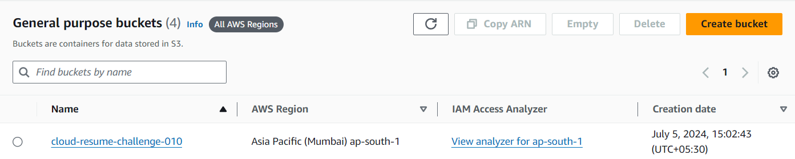
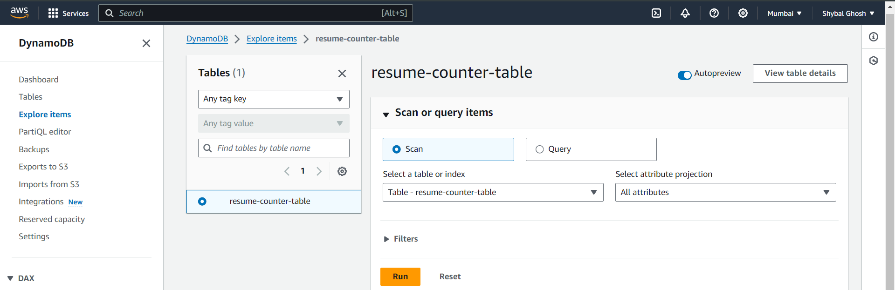
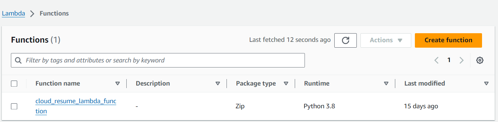

# AWS Cloud Resume Challenge

[Website Link](https://cloud.shybal-ghosh.me)

## About this Project

This is my attempt at the very famous cloud resume challenge.

What is this challenge? - The Cloud Resume Challenge is a multiple-step resume project that helps build and demonstrate skills fundamental to pursuing a career in the cloud. The project was published by Forrest Brazeal.

## Architecture

I have created a static website, hosted on an S3 bucket, with a visitor counter using the Lambda function. Further, the number of visitors is stored on a DynamoDB table and I have used the Lambda function to retrieve the current number of visitors from the table. Finally, I have exposed the S3 bucket using CloudFront distribution which only accepts HTTPS requests. Last but not least, I have used Terraform to build the entire infrastructure.

.png>)

## Structure

- `.github/workflows` - contains CI/CD pipeline configurations.
- `assets` - contains the pdf of my resume.
- `frontend` - contains the front end of the website.
- `infra` - contains the Infrastructure as Code (IaC) files.

## Screenshots

- ### S3 Bucket

  

- ### DynamoDB

  

- ### Lambda Function
  
